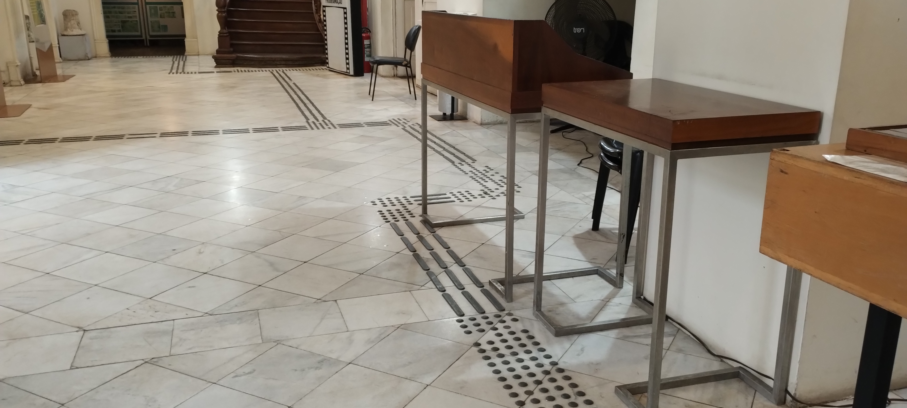
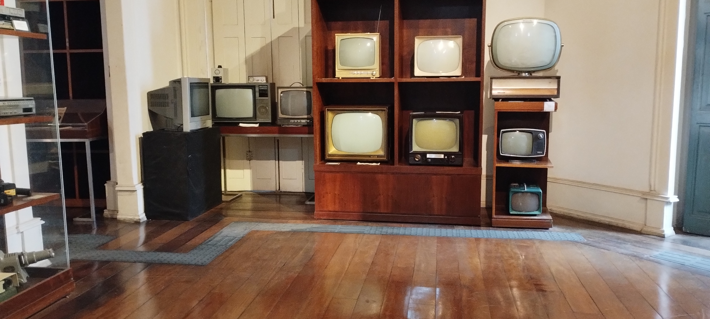
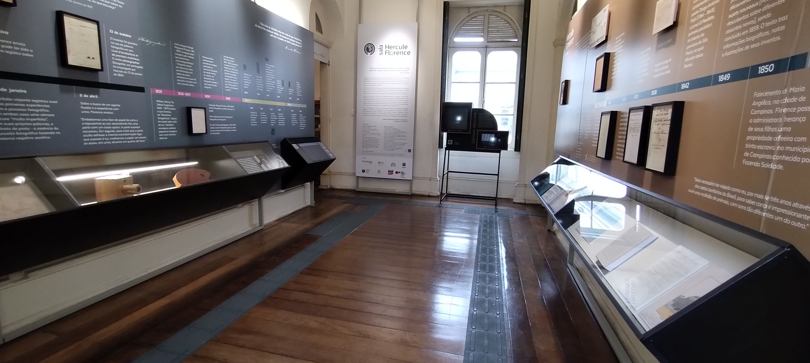

# Curador.ia

## Desafio

## Estrutura
O projeto está dividido em dois repositórios: *hackathon-llama-acessibilidade* (você está aqui) para o **front-end** e *hackathon-llama-acessibilidade-backend* (https://github.com/AllanAntunes/hackathon-llama-acessibilidade-backend) para o **back-end**.